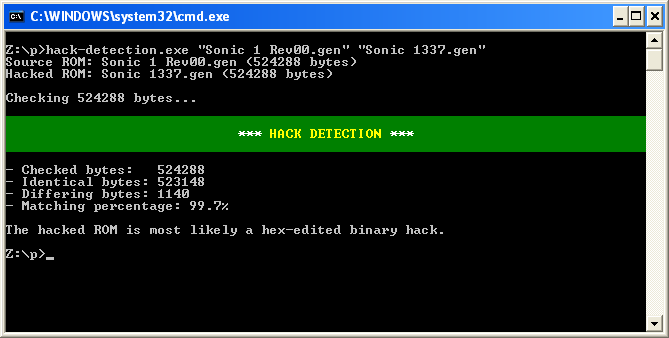
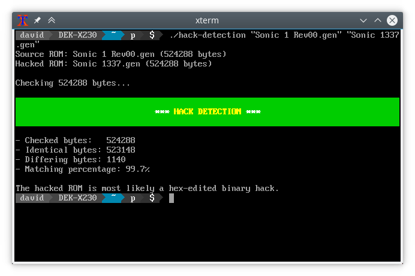

# *** HACK DETECTION ***

This is a simple command line utility that can check if a ROM hack appears
to be a hex-edited binary hack instead of a hack based on a disassembly.
It works by checking how many bytes in the two ROMs match and how many
differ. If more than 50% of the bytes are identical, it is assumed to be
a hex-edited binary hack.

If the source ROM has extra padding at the end (due to ROM chips being
powers-of-two sizes), the padding is ignored. Only the used area is checked.

If the hacked ROM is smaller than the source ROM, then anything past the
hacked ROM's size in the source ROM is ignored.

## How to use:

```
$ hack-detection [Source ROM] [Hacked ROM]
```

* Source ROM: The original ROM, e.g. "Sonic 1 Rev00.gen".
* Hacked ROM: The hacked ROM, e.g. "Sonic 1337.bin".

## Screenshots

These examples use Sonic 1 Rev00 as the source ROM and
[Sonic 1337](https://info.sonicretro.org/Sonic_1337) as the hacked ROM.





## License

hack-detection is licensed under the GNU AGPLv3. See [LICENSE.md](LICENSE.md)
for more information.
